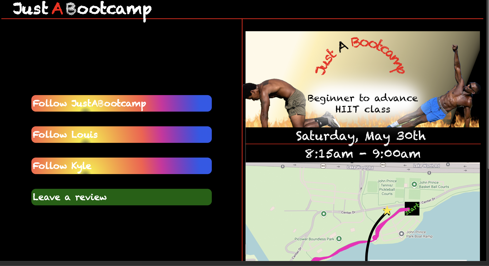
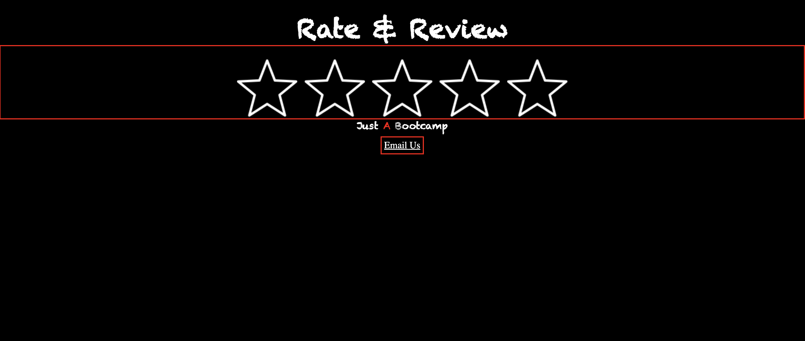
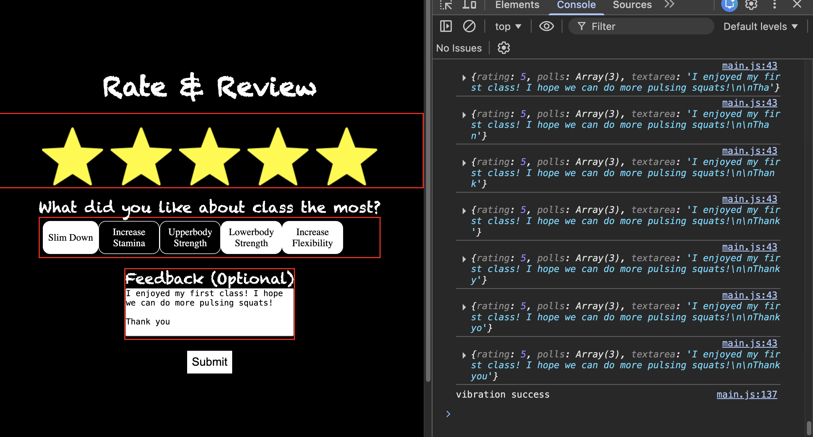

            <h1 id="logo-title" style="display:flex;gap:.5rem; align-items:center;justify-content:center;" class="header-font">Just 
A
 Bootcamp</h1>

# Inital Commit

#### Update 2026.05.27 - 2008-ET

#### Update 2026.05.28 - 0922-ET

#### Update 2026.05.28 - 1828-ET

Access static site <a target="_blank" href="https://index-daddy372466.github.io/justabootcamp/">here</a>

Access ratings <a target="_blank" href="https://index-daddy372466.github.io/justabootcamp/rating/rating.html">here</a>